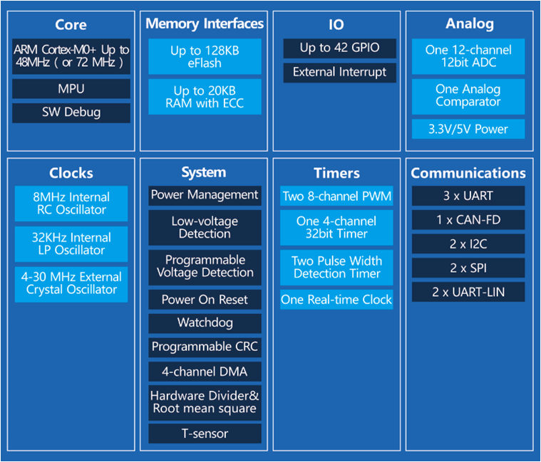

# [AC7801](https://github.com/SoCXin/AC7801)

* [autochips](http://www.autochips.com/)：[Cortex-M0](https://github.com/SoCXin/Cortex)
* [L4R4](https://github.com/SoCXin/Level) ：72 MHz * 0.95 DMIPS/MHz (285CoreMark)

## [简介](https://github.com/SoCXin/AC7801/wiki)

[AC7801](https://github.com/SoCXin/AC7801) 系列为车规MCU，符合AEC-Q100规范，适用于汽车电子和高可靠性工业应用，主要用于电控领域；
AC7801x系列芯片基于ARM Cortex®-M0+内核，运行主频48MHz(or 72MHz)，最高128KB Flash，最高20KB RAM。供电电压支持2.7~5.5V，具备出色EMC/ESD能力，能够适应更恶劣的环境。

### 关键特性

* CAN-FD，兼容CAN2.0B
* 温度范围: -40 to 125 °C

#### 封装规格

* QFN32
* LQFP48
* TSSOP20

### [资源收录](https://github.com/SoCXin)

* [参考文档](docs/)
* [参考资源](src/)
* [参考工程](project/)

### [选型建议](https://github.com/SoCXin)

[AC7801](https://github.com/SoCXin/AC7801)

### [探索芯世界 www.SoC.xin](http://www.SoC.Xin)
